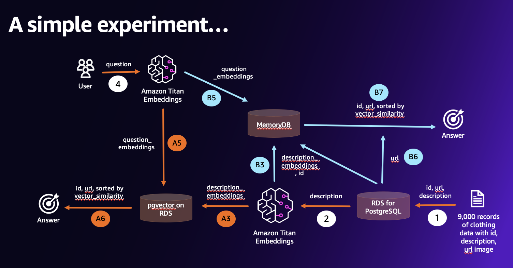
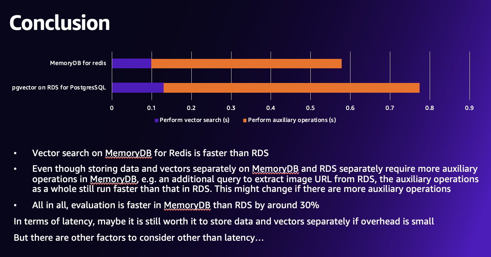

# Latency comparison between using pgvector on Amazon RDS and vector on Amazon MemoryDB

---

---

## Background

In re:Invent 2023, AWS announces additional vector capability on Amazon MemoryDB, Amazon Neptune, Amazon DocumentDB and Amazon DynamoDB. In particular, Amazon MemoryDB promises a fast experience with low latency for end users. 

In this notebook, we'll generate feature vectors for Fashion products from *__feidegger__*, a *__zalandoresearch__* dataset using Titan Embedding via Amazon Bedrock. We will conduct an experiment where we compare 2 cases: 1. we  store both data and vectors on RDS 2. we store data and vectors separately on RDS and MemoryDB. The question we are trying to answer is: is it worth it to store data and vectors separately on two data engines to take advantage of a particular vector engine, e.g. Amazon MemoryDB for Redis? 

## Architecture diagram

## Conclusion
I recorded the latency of 10 searches for both cases and got the following results:
